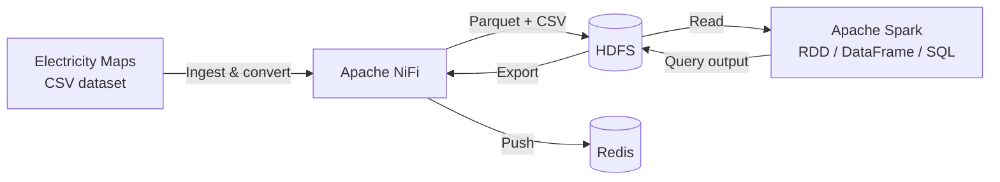
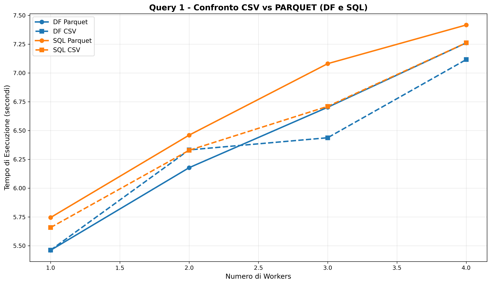
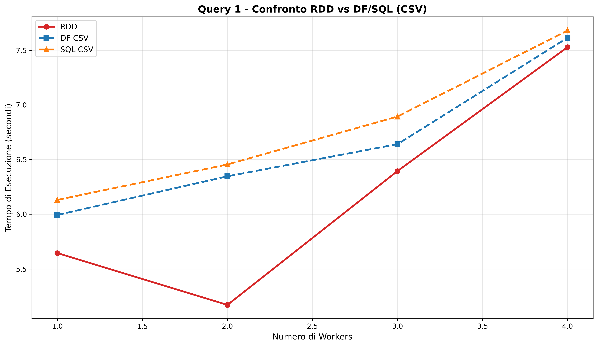
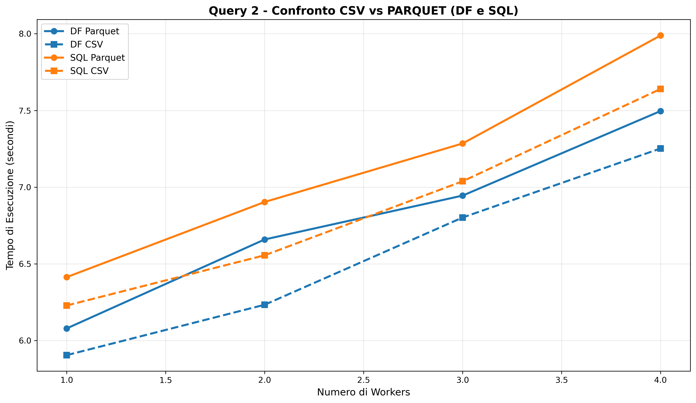
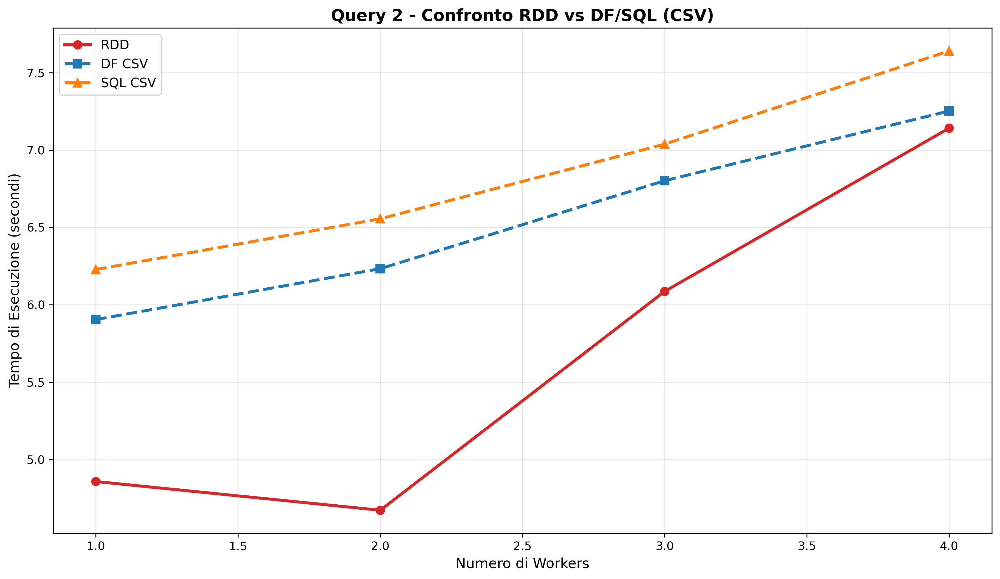
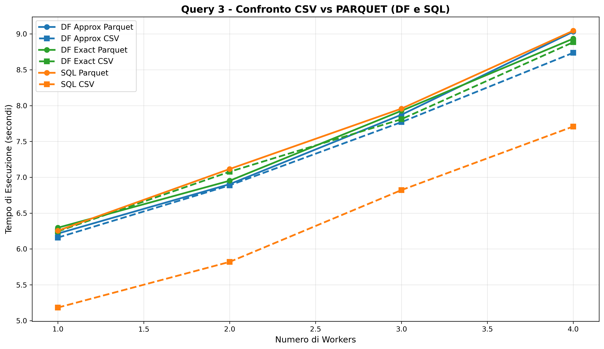
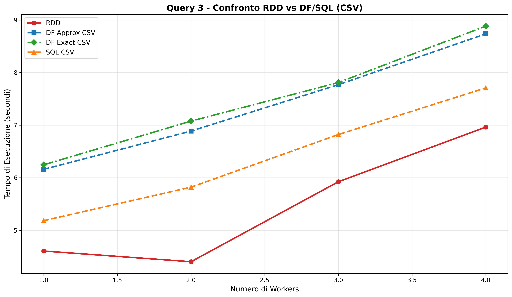

# BatchProcessingSABD

Batch analytics on energy grid data (carbon intensity & carbon-free energy %), built with **Apache Spark**, and benchmarked across execution engines, file formats and cluster sizes.

Developed for the *Sistemi e Architetture per Big Data* (SABD) course at Università degli Studi di Roma Tor Vergata, by Marco Lorenzini.

[](https://spark.apache.org/) [](https://nifi.apache.org/) [](https://hadoop.apache.org/) [](https://redis.io/) [](https://docs.docker.com/compose/)

## Overview

The project analyzes hourly historical data on **Carbon Intensity** and **Carbon-Free Energy percentage (CFE%)** for **Italy** and **Sweden** between 2021 and 2024, sourced from [Electricity Maps](https://www.electricitymaps.com/).

Beyond answering the analytical questions themselves, the project's main focus is a **systematic performance comparison**: every query is implemented three times — with the RDD API, the DataFrame API, and Spark SQL — and run against both CSV and Parquet input, across 1 to 4 Spark workers, to measure how execution engine, file format and cluster size each affect query latency.

## Architecture



Everything runs containerized via Docker Compose:

| Container | Role |
|---|---|
| `nifi` | Ingests the raw CSV dataset, converts it to Parquet, loads both formats into HDFS, and exports final query results to Redis |
| `namenode` / `datanode` | HDFS — data lake for raw input (CSV + Parquet) and query output |
| `spark-master` / `spark-worker` / `spark-history-server` | Spark cluster that runs the queries (worker count scaled at deploy time) |
| `redis` | Low-latency store for the final results |

## Queries

1. **Query 1 — Yearly statistics.** For each country and year (2021–2024), the average, minimum and maximum of Carbon Intensity and CFE%.
2. **Query 2 — Italy monthly ranking.** For Italy only, average Carbon Intensity and CFE% per (year, month), plus the top-5 (year, month) pairs by each metric, ascending and descending (20 values total).
3. **Query 3 — Hourly distribution.** For each country, the average Carbon Intensity and CFE% per hour of day, then the min, 25th/50th/75th percentile and max across those 24 hourly averages.

Each query is implemented three times to compare Spark's execution paths:

| Implementation | Files |
|---|---|
| DataFrame API | `query1.py`, `query2.py`, `query3.py` (+ `query3exact.py` for exact vs. approximate percentiles) |
| Spark SQL | `query1SQL.py`, `query2SQL.py`, `query3SQL.py` |
| RDD API | `query1RDD.py`, `query2RDD.py`, `query3RDD.py` |

Results are written as CSV to HDFS (`./Results/query*`) and exported to Redis for low-latency lookup.

## Benchmarking

`start.sh` automates the full benchmark matrix: for each worker count (1 to 4) it redeploys the cluster, reloads the dataset into HDFS via NiFi, and runs all query variants (RDD / DataFrame / SQL, CSV / Parquet) for multiple repetitions, logging execution time per run to `benchmark/execution_time.csv`.

`charts/chartsExecutor.py` then turns that log into comparison plots — CSV vs. Parquet and RDD vs. DataFrame vs. SQL, per query — saved under `charts/`:

| | |
|---|---|
|  |  |
|  |  |
|  |  |

## Tech stack

- **Apache Spark 3.5.0** (PySpark — RDD, DataFrame and SQL APIs)
- **Apache NiFi** — data ingestion, format conversion, and result export
- **HDFS (Hadoop 3.2.1)** — data lake for raw and processed data
- **Redis** — low-latency results store
- **pandas / matplotlib / seaborn** — benchmark result analysis and charting
- **Docker Compose** — cluster orchestration

## Project structure

```
src/
├── queries/            # DataFrame, SQL and RDD implementations of Query 1-3
└── utilities/          # Spark session setup, shared config (HDFS paths), timing helpers
charts/
├── chartsExecutor.py    # Turns benchmark/execution_time.csv into comparison plots
└── *.png                 # Generated benchmark charts
conf/spark-defaults.conf  # Spark cluster configuration
hadoop_conf/               # HDFS client/cluster configuration
Dockerfile, entrypoint.sh  # Spark image build + master/worker/history-server startup
docker-compose.yml         # NiFi + HDFS + Spark + Redis cluster
start.sh                   # End-to-end benchmark runner (1-4 workers, all query variants)
Results/                   # Query output (CSV) as written to HDFS
Report/                    # Written report
```

## Getting started

**Prerequisites**: Docker, Docker Compose.

```bash
docker compose up --build -d
```

This brings up NiFi (`localhost:8080`), the HDFS NameNode UI (`localhost:9870`), the Spark master UI (`localhost:9090`), the Spark History Server (`localhost:18080`) and Redis (`localhost:6379`). Once NiFi has loaded the dataset into HDFS, queries can be submitted individually, e.g.:

```bash
docker exec da-spark-master spark-submit --deploy-mode client /opt/spark/src/queries/query1.py parquet 2
```

To reproduce the full benchmark suite (all queries × implementations × formats × 1-4 workers) and regenerate the comparison charts:

```bash
./start.sh
python3 charts/chartsExecutor.py
```

## Report

A full write-up of the dataset, pipeline architecture and query design is available in [`Report/SABD_Relazione.pdf`](Report/SABD_Relazione.pdf).
